# Industrial Property Platform v1 — Specification Pack

> เอกสารสเปกรวมฉบับสมบูรณ์ · เวอร์ชัน 1.1 · 14 กรกฎาคม 2026 · สถานะ Draft
> แพลตฟอร์มนายหน้าให้เช่า/ขายโรงงานและโกดังในไทย (multilingual th/en/zh + GEO-ready)
>
> ไดอะแกรมทุกส่วนเป็น [Mermaid](https://mermaid.js.org) — GitHub และ Markdown viewer ส่วนใหญ่ render ให้อัตโนมัติ
> Source of truth ระดับเทคนิค: [ERD.dbml](ERD.dbml) · [openapi.yaml](openapi.yaml) · [STATUS_ENUMS.md](STATUS_ENUMS.md) · [API_CONTRACT.md](API_CONTRACT.md)

## สารบัญ

- **Part 1 — Requirement Specification** (FR 73 ข้อ / NFR 12 ข้อ + acceptance criteria)
- **Part 2 — Functional Specification** (พฤติกรรมรายหน้าจอ/ฟิลด์ + permissions + edge cases)
- **Part 3 — Flow Charts** (Lead pipeline + Flow A–E + Listing Publish)
- **Part 4 — UML Class Diagram** (domain model)
- **Part 5 — Sequence Diagrams** (ลำดับการเรียก API ราย flow)
- **Part 6 — ER Diagram** (schema 54 ตาราง — DBML)

---

## Part 1 · Requirement Specification

| | |
| --- | --- |
| เวอร์ชัน | 1.1 (ปรับ Flow B/C + Property ID + watermark + export ตาม feedback ลูกค้า) |
| วันที่ | 2026-07-14 |
| สถานะ | Draft — รอ approve ก่อนเริ่มพัฒนา |
| เอกสารอ้างอิง | [PRD.md](PRD.md) · [ERD.dbml](ERD.dbml) · [API_CONTRACT.md](API_CONTRACT.md) · [STATUS_ENUMS.md](STATUS_ENUMS.md) · [CONTENT_MODEL.md](CONTENT_MODEL.md) |

**วิธีอ่าน:** ทุก requirement มีรหัส (เช่น FR-LST-03) ใช้อ้างอิงใน task, commit, test case และการตรวจรับ
**Priority (MoSCoW):** `M` = Must (v1 ต้องมี) · `S` = Should (ควรมีใน v1 ถ้าเวลาพอ) · `C` = Could (ได้ก็ดี เลื่อนได้)

---

### 1. ภาพรวมระบบ

ระบบเว็บแพลตฟอร์มสำหรับธุรกิจนายหน้า/ที่ปรึกษาให้เช่า-ขายโรงงานและโกดังในประเทศไทย ประกอบด้วย 3 ชั้น:

1. **Public Website** — ค้นหาทรัพย์, ดูรายละเอียด, อ่านคอนเทนต์, ส่งคำถาม/requirement (3 ภาษา: th/en/zh)
2. **Admin / Operations** — จัดการ listings, leads, shortlists, นัดดูทรัพย์, negotiation, deals
3. **Content & GEO Layer** — CMS หลายภาษา + structured data ให้ Google และ AI search เข้าใจธุรกิจ

ระบบ**ไม่ใช่** self-serve marketplace — เป็น brokerage workflow platform ที่ทีมขายมนุษย์เป็นผู้ดำเนินการหลัก

#### ผู้ใช้งาน

| Actor | บทบาท |
| --- | --- |
| Public visitor | ค้นหาทรัพย์, ส่ง inquiry/requirement (ไม่มี login) |
| Sales agent | qualify lead, shortlist, visit, negotiate, close deal |
| Listing manager | จัดการ property/listing/media/availability |
| Content editor | จัดการ pages/articles/FAQ/SEO หลายภาษา |
| Operations coordinator | จัดตารางนัด, ประสาน landlord |
| Translator | แก้เฉพาะ translation fields |
| Super admin | จัดการ users/roles/settings/audit |

---

### 2. Functional Requirements

#### 2.1 Public Website (FR-PUB)

| ID | Requirement | Priority |
| --- | --- | --- |
| FR-PUB-01 | ระบบต้องมี homepage แสดง hero, จุดขายบริการ, featured listings, ช่องค้นหาเร็ว, CTA ติดต่อ | M |
| FR-PUB-02 | ทุกหน้า public ต้องรองรับ 3 ภาษา ผ่าน URL prefix `/th`, `/en`, `/zh` | M |
| FR-PUB-03 | ผู้ใช้ต้องสลับภาษาได้จากทุกหน้า โดยคงอยู่หน้าเดิม (หรือ fallback ไป homepage ของภาษานั้นถ้าไม่มี translation) | M |
| FR-PUB-04 | หน้า contact ต้องแสดงช่องทางติดต่อครบ: form, โทรศัพท์, Line, WeChat, WhatsApp, email | M |
| FR-PUB-05 | ระบบต้องมีหน้า FAQ แยกหมวดหมู่ พร้อม FAQPage schema | M |
| FR-PUB-06 | ระบบต้องมี guide/article hub (useful tips) แยกหมวด: permit, tax, EEC, renting-vs-buying | M |
| FR-PUB-07 | ระบบต้องมี service pages และ area pages ตามโครง GEO-ready (ดู FR-GEO) | M |
| FR-PUB-08 | ทุกหน้า public ต้อง responsive (mobile-first) | M |

#### 2.2 Search & Listing Discovery (FR-SRC)

| ID | Requirement | Priority |
| --- | --- | --- |
| FR-SRC-01 | ผู้ใช้ต้องค้นหา listings ด้วย filter: property type (warehouse/factory/land/mixed), transaction type (rent/sale/both), จังหวัด/อำเภอ/ตำบล, นิคมอุตสาหกรรม, ขนาด (min–max sqm), งบเช่า (min–max), งบซื้อ (min–max), factory license possible, featured | M |
| FR-SRC-02 | ผลค้นหาต้อง sort ได้: published date, price, size (asc/desc) — เฉพาะ whitelist | M |
| FR-SRC-03 | ผลค้นหาต้องมี pagination (default 20, max 100 ต่อหน้า) พร้อมจำนวนผลรวม | M |
| FR-SRC-04 | Filter state ต้องอยู่ใน URL query string (แชร์ลิงก์ผลค้นหาได้) | M |
| FR-SRC-05 | ต้องมี full-text search (`q`) ค้นจาก title/description ด้วย PostgreSQL full-text | M |
| FR-SRC-06 | ต้องแสดง empty state ชัดเจนเมื่อไม่มีผลลัพธ์ พร้อมทางเลือก (ล้าง filter / ส่ง requirement) | M |
| FR-SRC-07 | ผู้ใช้ต้องเปรียบเทียบ listings ได้สูงสุด 4 รายการ (session-based, ไม่ต้อง login) | S |
| FR-SRC-08 | Listing card ต้องแสดง: รูป cover, title, type, location (ระดับที่อนุญาต), ขนาด, ราคา, Property ID (public_code) | M |
| FR-SRC-09 | Listing ที่ transaction_type = `both` ต้องปรากฏทั้งหน้าประกาศเช่าและหน้าประกาศซื้อ (ลงโพสต์ครั้งเดียว แสดง 2 หน้า): filter `rent` รวมผล `rent`+`both`, filter `sale` รวมผล `sale`+`both` | M |

#### 2.3 Listing Detail (FR-LST)

| ID | Requirement | Priority |
| --- | --- | --- |
| FR-LST-01 | หน้า detail ต้องแสดง: gallery, specs ครบ (land/built-up/warehouse/office area, clear height, floor loading, power), location summary, จุดเด่น, ราคา rent/sale, listing code | M |
| FR-LST-02 | ตำแหน่งทรัพย์ต้องแสดงตาม `map_visibility_level` เท่านั้น — **ห้ามเปิดเผย exact address/พิกัดจริงต่อสาธารณะ** เมื่อระดับเป็น subdistrict/district/province | M |
| FR-LST-03 | ต้องมีปุ่ม inquiry ผูกกับ listing นั้น (ส่ง listing_ids ไปกับ inquiry) | M |
| FR-LST-04 | ต้องแสดง related listings (พื้นที่/ประเภทใกล้เคียง) | S |
| FR-LST-05 | ต้องแสดง `updated_at` และ availability note ("ราคา/สถานะไม่การันตี ต้องตรวจสอบอีกครั้ง") | M |
| FR-LST-06 | Listing ที่ไม่ใช่สถานะ `published` ต้องเข้าถึงไม่ได้จาก public (404) | M |

#### 2.4 Inquiry & Requirement Intake (FR-INQ)

| ID | Requirement | Priority |
| --- | --- | --- |
| FR-INQ-01 | ต้องมีฟอร์ม inquiry ทั่วไป: ชื่อ, email, โทร, ข้อความ, ภาษา, listing ที่สนใจ (optional) | M |
| FR-INQ-02 | ต้องมีฟอร์ม requirement แบบละเอียด: ข้อมูลบริษัท (ชื่อ, ประเทศจดทะเบียน, เว็บไซต์, ประเภทธุรกิจ), operation type, ต้องการใบ ร.ง.4 หรือไม่, ขนาด min–max, งบ rent/sale min–max, วันที่ย้ายเข้า, near port/airport/bangkok, พื้นที่ที่ต้องการ (หลายรายการ + priority), notes | M |
| FR-INQ-03 | การ submit ต้องสร้าง lead + lead_contact (+ company, requirement, requirement_locations ตามข้อมูลที่ให้) อัตโนมัติ | M |
| FR-INQ-04 | Validation ฝั่ง server: ต้องมีอย่างน้อย 1 contact method, budget min ≤ max, size min ≤ max, move-in date ไม่เป็นอดีต | M |
| FR-INQ-05 | ต้องมี spam protection (rate limit + honeypot อย่างน้อย) | M |
| FR-INQ-06 | ระบบต้องแจ้งเตือนทีมขายเมื่อมี requirement ใหม่ (async job — email/notification ภายใน) | S |

#### 2.5 CRM & Lead Management (FR-CRM)

| ID | Requirement | Priority |
| --- | --- | --- |
| FR-CRM-01 | Lead dashboard ต้อง filter ได้: status, assigned agent, source channel, ช่วงวันที่, keyword | M |
| FR-CRM-02 | Lead status ต้องเป็นไปตาม state machine ใน STATUS_ENUMS.md เท่านั้น (`new → ... → won/lost`) | M |
| FR-CRM-03 | Lead detail ต้องแสดง: contacts, company, requirement summary, notes timeline, tasks, linked shortlists/visits/deals | M |
| FR-CRM-04 | ต้อง assign lead ให้ agent ได้ (manual) และ sales agent เห็นเฉพาะ lead ที่ตัวเองได้รับมอบหมาย | M |
| FR-CRM-05 | ต้องเพิ่ม notes และ tasks (พร้อม due date, priority) ผูกกับ lead ได้ | M |
| FR-CRM-06 | ทุก action สำคัญบน lead ต้องบันทึกลง activities log | M |
| FR-CRM-07 | การ cancel requirement ต้องบันทึกเหตุผล + ระบุข้อ requirement ที่เป็นเหตุ (เช่น budget, ขนาด, พื้นที่, ใบอนุญาต) — บังคับทั้ง 2 ฟิลด์ | M |

#### 2.6 Shortlist Operations (FR-SHL)

| ID | Requirement | Priority |
| --- | --- | --- |
| FR-SHL-01 | Agent ต้องสร้าง shortlist จาก requirement ได้ โดยค้นหา/เพิ่ม listings, จัด rank, ใส่ internal notes | M |
| FR-SHL-02 | ห้ามเพิ่ม listing ซ้ำใน shortlist เดียวกัน, ห้ามเพิ่ม listing ที่ไม่ใช่ `published` และต้องผ่านเงื่อนไข availability ตาม FR-AVL-04 | M |
| FR-SHL-03 | ส่ง shortlist ให้ลูกค้าได้เมื่อมี ≥ 1 item — การส่งเปลี่ยน status เป็น `sent` + บันทึก `sent_at` | M |
| FR-SHL-04 | ต้องบันทึก client feedback ต่อ item ได้: interested / not_interested / undecided | M |
| FR-SHL-05 | Shortlist ที่ส่งแล้วต้องมี view สำหรับลูกค้า (public link แบบ token — ไม่ต้อง login) | S |

#### 2.7 Availability Check (FR-AVL)

| ID | Requirement | Priority |
| --- | --- | --- |
| FR-AVL-01 | ทีมงานต้องบันทึกผลเช็ค availability กับ landlord ต่อ listing ได้: result (available/unavailable/pending_landlord), notes, valid_until | M |
| FR-AVL-02 | ประวัติ availability checks ต้องดูได้จากหน้า listing admin | M |
| FR-AVL-03 | Listing ที่เช็คแล้ว unavailable ต้องเปลี่ยนสถานะได้จากจุดเดียวกัน | S |
| FR-AVL-04 | เพิ่ม listing เข้า shortlist ได้เฉพาะเมื่อ availability check ล่าสุด = `available` และยังไม่เกิน `valid_until` (Flow B ใหม่: เช็คว่างก่อนสร้าง shortlist — ไม่ว่างให้กลับไปคัดทรัพย์ตัวอื่น) | M |

#### 2.8 Visit Operations (FR-VIS)

| ID | Requirement | Priority |
| --- | --- | --- |
| FR-VIS-01 | ต้องสร้าง visit plan ผูกกับ lead + requirement ได้: วันที่, session (half_day/full_day), route notes | M |
| FR-VIS-02 | Visit plan ประกอบด้วย appointments หลายรายการ แต่ละ appointment ผูก landlord + เวลาเริ่ม/จบ + listings ตามลำดับ | M |
| FR-VIS-03 | Validation: เวลาจบ > เวลาเริ่ม, ห้ามเพิ่ม listing ที่ unavailable/archived | M |
| FR-VIS-04 | ระบบต้องเตือน (soft warning) เมื่อจำนวน listings ต่อ session เกิน 8 | S |
| FR-VIS-05 | ต้องบันทึกผลหลังดูทรัพย์ต่อ listing: feedback notes + outcome status | M |
| FR-VIS-06 | Visit จะ mark completed ได้ต่อเมื่อมี appointment อย่างน้อย 1 รายการ | M |
| FR-VIS-07 | ก่อนสร้าง visit plan ต้องบันทึกยืนยันจากลูกค้าว่าไม่เปลี่ยน criteria — ถ้าเปลี่ยน ให้แก้ requirement แล้วเริ่ม Flow B ใหม่ (Flow C ใหม่) | M |

#### 2.9 Negotiation & Deals (FR-DEA)

| ID | Requirement | Priority |
| --- | --- | --- |
| FR-DEA-01 | ต้องเปิด negotiation case ผูก lead + listing + agent ได้ พร้อม stage ตาม enum | M |
| FR-DEA-02 | ต้องบันทึก offers/counter-offers: ฝั่ง (client/landlord), จำนวนเงิน, เงื่อนไข, เวลา | M |
| FR-DEA-03 | ต้องสร้าง deal จาก negotiation ได้: agreed amount, transaction type, signed/close date | M |
| FR-DEA-04 | ต้องแนบ deal documents (upload ไป S3-compatible storage) พร้อม document type + status | M |
| FR-DEA-05 | Deal close ได้จาก valid active state เท่านั้น — หลัง close ฟิลด์การเงิน read-only (super_admin override ได้) | M |
| FR-DEA-06 | ต้องบันทึก commission ต่อ deal ต่อ agent ได้ | S |

#### 2.10 Property & Listing Management (FR-ADM)

| ID | Requirement | Priority |
| --- | --- | --- |
| FR-ADM-01 | CRUD property: specs ครบตาม ERD (พื้นที่, ความสูง, floor loading, ไฟฟ้า, zoning, license) + geography + landlord/developer | M |
| FR-ADM-02 | CRUD listing แยกจาก property (1 property มีได้หลาย listing) พร้อม transaction type, ราคา, availability window | M |
| FR-ADM-03 | Media upload: หลายรูปต่อ property, จัดลำดับ, กำหนด cover, alt text | M |
| FR-ADM-04 | Publish rule: listing publish ได้ต่อเมื่อมี ≥ 1 translation และ ≥ 1 cover media | M |
| FR-ADM-05 | Listings index: filter ตาม status/type/location/featured/updated, ค้นหาด้วย code/title, bulk publish/unpublish | M |
| FR-ADM-06 | ทุกการเปลี่ยนราคาต้องบันทึกลง price_history อัตโนมัติ | M |
| FR-ADM-07 | Translation tabs ต่อ property/listing สำหรับ th/en/zh | M |
| FR-ADM-08 | Property ID (`public_code`) ต้อง generate อัตโนมัติและ read-only: กรุงเทพ `JKP{n}` / ต่างจังหวัด `JKP-{ตัวย่อจังหวัด EN 3 ตัว}{n}` โดย `{n}` = เลขรัน **4 หลัก zero-pad เริ่มที่ `0001`** นับแยกต่อ prefix เช่น สมุทรปราการ `JKP-SPK0001`, กทม `JKP0001` — ตัวย่อจาก `provinces.code` | M |
| FR-ADM-09 | ตอนอัปโหลดรูปต้องเลือกลายน้ำได้ 2 แบบ (บันทึก `watermark_type` ต่อรูป และ apply ลายน้ำก่อนแสดงบน public) | M |
| FR-ADM-10 | ต้อง export ประกาศทั้งหมด (ตาม filter ปัจจุบัน) เป็น Excel (.xlsx) และ CSV ที่เปิดใน Google Sheets ได้ | M |

#### 2.11 CMS (FR-CMS)

| ID | Requirement | Priority |
| --- | --- | --- |
| FR-CMS-01 | CRUD pages (service/area/landing/static), articles, FAQ items, certifications | M |
| FR-CMS-02 | ทุก content entity มี translation ต่อภาษา พร้อม slug ต่อภาษา (unique ภายใน language) | M |
| FR-CMS-03 | Publish workflow: draft → published + เก็บ published_at | M |
| FR-CMS-04 | Rich text editor สำหรับ body content | M |
| FR-CMS-05 | Internal links จาก content ไป listings/services/areas ได้ | S |
| FR-CMS-06 | Role `translator` แก้ได้เฉพาะ translation fields | S |

#### 2.12 SEO / GEO (FR-GEO)

| ID | Requirement | Priority |
| --- | --- | --- |
| FR-GEO-01 | ทุก public entity มี SEO metadata ต่อภาษา: meta title/description, canonical, robots, OG tags | M |
| FR-GEO-02 | JSON-LD ต่อ page type: Organization (sitewide), Service, FAQPage, Article, Product/Offer + BreadcrumbList (listing) | M |
| FR-GEO-03 | hreflang tags เชื่อม th/en/zh variants ทุกหน้า + canonical ถูกต้อง | M |
| FR-GEO-04 | sitemap.xml สร้างอัตโนมัติ (async job) + robots.txt + llms.txt | M |
| FR-GEO-05 | Service/area/guide pages ต้องมีโครง GEO-ready: direct answer block เปิดหน้า, FAQ section, internal links, CTA ตาม intent | M |
| FR-GEO-06 | Admin ต้อง preview schema JSON-LD ต่อ entity ได้ก่อน publish | S |
| FR-GEO-07 | Listing pages แสดง updated date เป็น freshness signal | M |

#### 2.13 Auth, Roles & Audit (FR-SEC)

| ID | Requirement | Priority |
| --- | --- | --- |
| FR-SEC-01 | Admin auth ด้วย JWT/session — public site ไม่มี login | M |
| FR-SEC-02 | RBAC 6 roles ตาม PRD §11 — enforce ที่ API layer ไม่ใช่แค่ UI | M |
| FR-SEC-03 | ทุก admin action ที่เปลี่ยนข้อมูลต้องลง audit_logs (user, entity, action, before/after) | M |
| FR-SEC-04 | Password hash ด้วย algorithm มาตรฐาน (bcrypt/argon2), session expiry, brute-force protection | M |

---

### 3. Non-Functional Requirements

| ID | Requirement | Target |
| --- | --- | --- |
| NFR-01 | **Performance:** หน้า public โหลด (LCP) | ≤ 2.5s บน 4G |
| NFR-02 | **Performance:** API list endpoints ตอบกลับ | p95 ≤ 500ms ที่ 10k listings |
| NFR-03 | **SEO:** ทุกหน้า public เป็น SSR/SSG — เนื้อหาครบใน HTML แรกโดยไม่ต้องรัน JS | บังคับ |
| NFR-04 | **i18n:** เนื้อหา UI ทั้งหมด (label, ปุ่ม, error message) มาจาก translation files — ห้าม hardcode | บังคับ |
| NFR-05 | **Security:** OWASP baseline — input validation ทุก endpoint, parameterized queries (Prisma), CSRF protection admin, security headers | บังคับ |
| NFR-06 | **Security:** ข้อมูลติดต่อลูกค้า/landlord เข้าถึงได้เฉพาะ role ที่เกี่ยวข้อง (PDPA-aware) | บังคับ |
| NFR-07 | **Observability:** structured logs, request ID ทุก API response, error boundaries ใน UI | บังคับ |
| NFR-08 | **Data:** timestamps (created/updated) ทุกตารางสำคัญ, soft-state ผ่าน status ไม่ hard delete ข้อมูลธุรกิจ | บังคับ |
| NFR-09 | **Scalability:** รองรับ 10,000 listings, 50,000 leads โดยไม่ปรับ architecture | เป้า v1 |
| NFR-10 | **Compatibility:** เบราว์เซอร์ modern 2 เวอร์ชันล่าสุด (Chrome, Safari, Edge, Firefox) + mobile | บังคับ |
| NFR-11 | **Backup:** managed PostgreSQL พร้อม daily backup + point-in-time recovery | บังคับ |
| NFR-12 | **Code quality:** TypeScript strict, ห้าม `any`, ESLint ผ่านทุก commit | บังคับ |

---

### 4. Data Requirements

- Schema v1 = [ERD.dbml](ERD.dbml) (54 ตาราง, 8 enums) — Prisma schema ต้อง sync 100%
- Enum ทั้งหมด lock ตาม [STATUS_ENUMS.md](STATUS_ENUMS.md) — เพิ่ม/แก้ต้องอัปเดตเอกสาร + migration พร้อมกัน
- Translation tables แยกจาก main tables — ห้ามเก็บหลายภาษาในคอลัมน์เดียว
- Seed data ขั้นต่ำ: 3 ภาษา, 6 roles, taxonomy, ตัวอย่าง geography, admin user, 10 listings, 5 FAQ, 5 articles, 3 service pages, 3 area pages

### 5. Interface Requirements

- REST API ตาม [API_CONTRACT.md](API_CONTRACT.md): 3 surfaces (public/admin/ops), base `/api/v1`, envelope `data/meta/errors` คงที่
- OpenAPI 3.1 spec (`docs/openapi.yaml`) ต้องถูก generate ใน Phase 1 และเป็น contract ผูกพันระหว่าง frontend/backend
- Object storage: S3-compatible API (presigned upload)
- v1 ไม่มี public webhook / third-party integration

### 6. Constraints & Assumptions

**Constraints**
- Stack ตายตัว: Next.js App Router + TypeScript, Tailwind + shadcn/ui, PostgreSQL + Prisma, monorepo
- v1 ใช้ Next.js API routes (ไม่แยก backend service)
- Search ใช้ PostgreSQL full-text (ยังไม่ใช้ Elasticsearch/Algolia)

**Assumptions**
- ข้อมูล listing นำเข้าโดย admin ผ่าน UI (ยังไม่มี CSV import ใน v1 — เป็น v1.1 candidate)
- Lead assignment เป็น manual โดย ops/admin
- Compare เป็น client-side/session — ไม่ persist ต่อ user
- เว็บอ้างอิง (thaiindustrialproperty.com) ใช้เป็นแรงบันดาลใจเชิงโครงสร้างเท่านั้น — ไม่มีการคัดลอกเนื้อหา ดีไซน์ หรือข้อมูล

### 7. Out of Scope (v1)

landlord portal · customer login/dashboard · e-signature · online payments · ML recommendation · full GIS/map search · native mobile app · no-code workflow automation · CSV bulk import · public webhooks

### 8. Acceptance Criteria (การตรวจรับ)

ระบบถือว่าผ่านการตรวจรับเมื่อ:

1. **Functional:** ทุก FR ระดับ `M` ผ่าน test case ที่อ้างอิงรหัส FR — demo ได้บน staging
2. **Flows end-to-end (ตาม PRD §5):**
   - A: ค้นหา → เปิด detail → ส่ง inquiry → lead ปรากฏใน CRM
   - B: ส่ง requirement → confirm/cancel (cancel: เหตุผล+ข้อ requirement) → เช็คว่าง → สร้าง shortlist → ส่งลูกค้า → บันทึก feedback
   - C: ยืนยัน criteria ไม่เปลี่ยน → visit plan → ยืนยันเจ้าของ → พาชม → บันทึกผล
   - D: negotiation → offers → close deal → เอกสาร + commission
   - E: สร้าง article 3 ภาษา → publish → render พร้อม schema + hreflang
3. **GEO validation:** ทุก page type ผ่าน Google Rich Results Test (JSON-LD valid) และ hreflang ตรวจด้วย crawler ภายใน
4. **NFR:** Lighthouse performance ≥ 85 (mobile) บนหน้า listing/detail, API p95 ตามเป้า
5. **Tests:** unit + integration + E2E ตาม PRD §14 ผ่านทั้งหมดใน CI
6. **Docs:** เอกสารทั้ง 8 artifacts (PRD §18) sync กับสิ่งที่ build จริง

### 9. Traceability Matrix

| Module | FR | PRD | ERD tables | API |
| --- | --- | --- | --- | --- |
| Public site | FR-PUB | §4.1, §7 | languages, pages | public/pages, public/faqs |
| Search | FR-SRC | §4.1 | listings, properties, geo | GET public/listings, compare |
| Listing detail | FR-LST | §4.1, §9 | listings, property_media, seo_metadata | GET public/listings/{id} |
| Intake | FR-INQ | §4.3, §9 | leads, requirements, companies | POST inquiries, requirements |
| CRM | FR-CRM | §4.3, §10 | leads, lead_notes, tasks, activities | ops/leads |
| Shortlist | FR-SHL | §4.4, §9 | shortlists, shortlist_items | ops/shortlists |
| Availability | FR-AVL | §4.2 | availability_checks | admin/listings/{id}/availability-checks |
| Visits | FR-VIS | §4.5, §9 | visit_plans, appointments, visit_properties | ops/visit-plans |
| Deals | FR-DEA | §4.6, §9 | negotiation_cases, offers, deals, commissions | ops/negotiation-cases, ops/deals |
| Listing mgmt | FR-ADM | §4.2, §8 | properties, listings, price_history | admin/properties, admin/listings |
| CMS | FR-CMS | §4.7 | pages, articles, faq_items + translations | admin CMS endpoints |
| SEO/GEO | FR-GEO | §4.7, CONTENT_MODEL | seo_metadata | admin/seo-metadata |
| Security | FR-SEC | §11 | users, roles, audit_logs | auth + RBAC ทุก endpoint |

---

## Part 2 · Functional Specification

| | |
| --- | --- |
| เวอร์ชัน | 1.1 (ปรับ Flow B/C + Property ID + watermark + export ตาม feedback ลูกค้า) |
| วันที่ | 2026-07-14 |
| สถานะ | Draft |
| ระดับเอกสาร | Behavior รายหน้าจอ/รายฟิลด์ — ต่อจาก [REQUIREMENTS_SPEC.md](REQUIREMENTS_SPEC.md) (อ้างรหัส FR) |
| เอกสารอ้างอิง | [PRD.md](PRD.md) · [ERD.dbml](ERD.dbml) · [API_CONTRACT.md](API_CONTRACT.md) · [STATUS_ENUMS.md](STATUS_ENUMS.md) · [CONTENT_MODEL.md](CONTENT_MODEL.md) |

---

### 1. Global conventions

#### 1.1 Routing & ภาษา
- Public: `/{lang}/...` โดย `lang ∈ {th, en, zh}` — ไม่มี prefix → redirect 302 ไป `/th` (default)
- Language switcher: ลิงก์ไป URL เดียวกันของอีกภาษา (จาก hreflang mapping) — ถ้า entity นั้นไม่มี translation ภาษาปลายทาง → ไปหน้า index ของ section นั้นในภาษาปลายทาง พร้อม toast "เนื้อหานี้ยังไม่มีภาษา X"
- Admin: `/admin/...` ภาษาเดียว (อังกฤษหรือไทย เลือกตอน implement — UI label มาจาก translation file ตาม NFR-04)

#### 1.2 การแสดงผลข้อมูล
- วันที่แสดงผล: `DD MMM YYYY` ตาม locale (เก็บเป็น ISO 8601 UTC)
- เงิน: คั่นหลักพัน + สกุล เช่น `฿250,000 /เดือน`, `฿45,000,000` — ค่า null แสดง "ติดต่อสอบถาม"
- พื้นที่: `3,000 ตร.ม.` (sqm)
- ราคาเช่าแสดงต่อเดือนเสมอ

#### 1.3 Error handling (ทุกฟอร์ม)
- Client-side validate ก่อน submit (แสดงใต้ฟิลด์) → server-side validate ซ้ำเสมอ (FR-INQ-04)
- Error จาก API (`errors[]` ใน envelope) map กลับไปที่ฟิลด์ด้วย `field` — error ที่ไม่มี field แสดงเป็น banner บนฟอร์ม
- Network error: banner "เกิดข้อผิดพลาด กรุณาลองใหม่" + คงค่าที่กรอกไว้ (ห้าม clear form)

#### 1.4 สถานะและการเปลี่ยนสถานะ
- ทุก status ใช้ค่าจาก [STATUS_ENUMS.md](STATUS_ENUMS.md) เท่านั้น
- การเปลี่ยนสถานะทำได้เฉพาะ transition ที่ระบุใน state machine — API ปฏิเสธ transition อื่นด้วย `INVALID_STATUS_TRANSITION`
- ทุกการเปลี่ยนสถานะบันทึกลง `activities` (CRM entities) หรือ `audit_logs` (admin entities)

---

### 2. Public Website

#### 2.1 Homepage — `/{lang}` (FR-PUB-01)

| Section | เนื้อหา | ที่มาข้อมูล | Behavior |
| --- | --- | --- | --- |
| Hero | headline + subheadline + quick search bar | page translation (CMS) | quick search: เลือก type + transaction + จังหวัด → submit ไป `/listing?...` |
| Trust bar | certifications logos | `certifications` (active) | ลิงก์ external ถ้ามี |
| Featured listings | การ์ด 6–8 รายการ | listings `featured_flag=true, status=published` เรียง `published_at desc` | คลิก → detail |
| บริการ 4 ขั้นตอน | requirement → shortlist → visit → close | static content (CMS page) | CTA "ส่งความต้องการ" → requirement form |
| Latest guides | บทความล่าสุด 3 รายการ | `articles` published ภาษานั้น | คลิก → article detail |
| CTA footer | ช่องทางติดต่อทั้งหมด | config | FR-PUB-04 |

#### 2.2 Listing Search — `/{lang}/listing` (FR-SRC)

**Filter panel** (desktop: sidebar ซ้าย / mobile: bottom sheet เปิดจากปุ่ม "ตัวกรอง"):

| Control | ชนิด | ค่า | หมายเหตุ |
| --- | --- | --- | --- |
| ประเภททรัพย์ | select | warehouse / factory / land / mixed | |
| เช่า/ขาย | segmented | rent / sale / both | **เลือก `rent` → แสดง rent+both, เลือก `sale` → แสดง sale+both** (โพสต์เดียวขึ้นทั้ง 2 หน้า — FR-SRC-09) |
| จังหวัด | select (search ได้) | จาก `provinces` | เลือกแล้วโหลดอำเภอ |
| อำเภอ | select | `districts` ตามจังหวัด | disabled จนเลือกจังหวัด |
| ตำบล | select | `subdistricts` ตามอำเภอ | disabled จนเลือกอำเภอ |
| นิคมอุตสาหกรรม | select (search ได้) | `industrial_zones` active | เลือกแทน/ร่วมกับ location ได้ |
| ขนาด (ตร.ม.) | range input คู่ | size_min / size_max | validate min ≤ max ทันที |
| งบเช่า (บาท/เดือน) | range input คู่ | rent_min / rent_max | แสดงเมื่อ transaction ∈ {rent, both} |
| งบซื้อ (บาท) | range input คู่ | sale_min / sale_max | แสดงเมื่อ transaction ∈ {sale, both} |
| ขอใบ ร.ง.4 ได้ | checkbox | factory_license_possible=true | |
| คำค้น | text | `q` — full-text | debounce 400ms |

**Behavior:**
- ทุกการเปลี่ยน filter → อัปเดต URL query ทันที (FR-SRC-04) → fetch ผลใหม่ (ไม่ full reload)
- เปิดหน้าด้วย query ใน URL → ต้อง restore filter state ทั้งหมด
- Sort dropdown: ใหม่ล่าสุด (default) / ราคาต่ำ→สูง / ราคาสูง→ต่ำ / ขนาดใหญ่→เล็ก
- Active filters แสดงเป็น chips ลบทีละตัวได้ + ปุ่ม "ล้างทั้งหมด"
- ผลลัพธ์: จำนวนรวม "พบ N รายการ" + grid การ์ด + pagination ตัวเลข
- Empty state (FR-SRC-06): ภาพประกอบ + "ไม่พบทรัพย์ที่ตรงเงื่อนไข" + ปุ่ม [ล้างตัวกรอง] และ [ส่งความต้องการให้ทีมงานหาให้] → requirement form พร้อม prefill filter ที่เลือกไว้
- Compare (FR-SRC-07): checkbox บนการ์ด สูงสุด 4 (ตัวที่ 5 → toast แจ้ง) เก็บใน sessionStorage; แถบล่างลอยแสดงรายการที่เลือก + ปุ่ม "เปรียบเทียบ" → หน้า compare ตาราง spec ต่อ spec

#### 2.3 Listing Detail — `/{lang}/property/{slug}` (FR-LST)

ลำดับ section บนหน้า:

1. **Gallery** — รูปทั้งหมดเรียงตาม `sort_order`, cover ขึ้นก่อน, lightbox เต็มจอ, lazy load
2. **Header** — title (translation), **Property ID** (`public_code` รูปแบบ `JKP{n}` / `JKP-{จังหวัด}{n}` — FR-ADM-08), badges (ประเภท, เช่า/ขาย, featured), ราคา rent/sale
3. **Specs table** — land/built-up/warehouse/office area, clear height, floor loading, power (kVA), ร.ง.4 possible — ฟิลด์ null ไม่แสดงแถว
4. **Location** — แสดงตาม `map_visibility_level` (FR-LST-02):
   - `exact` → แผนที่หมุดจริง (ถ้าเจ้าของอนุญาตเท่านั้น)
   - `subdistrict`/`district`/`province` → ข้อความ "ตำบล X อำเภอ Y จังหวัด Z" + แผนที่ระดับพื้นที่ (วงกลมคลุมพื้นที่ ไม่มีหมุด) — **API ต้องไม่ส่ง lat/long จริงออกมาเลย** ในกรณีนี้
5. **จุดเด่น** — key_selling_points จาก translation
6. **Availability note** — "ข้อมูล ณ วันที่ {updated_at} — สถานะว่างต้องตรวจสอบกับทีมงานอีกครั้ง" (FR-LST-05)
7. **Inquiry box** (sticky บน desktop) — ฟอร์มย่อ: ชื่อ, email/โทร, ข้อความ → submit เป็น inquiry พร้อม `listing_ids=[this]` (FR-LST-03)
8. **Related listings** — 4 รายการ: จังหวัดเดียวกัน + type เดียวกัน, ไม่รวมตัวเอง (FR-LST-04)

**Edge cases:**
- slug ไม่พบ / listing ไม่ published → 404 (FR-LST-06)
- เข้าด้วย slug ภาษาอื่น → 301 ไป slug ของภาษาปัจจุบัน

#### 2.4 Requirement Form — `/{lang}/requirement` (FR-INQ-02..05)

ฟอร์มแบบ wizard 3 ขั้น (แสดง progress):

**Step 1 — ความต้องการ**

| ฟิลด์ | ชนิด | บังคับ | Validation |
| --- | --- | --- | --- |
| ต้องการ | segmented: เช่า/ซื้อ/ทั้งสอง | ✓ | |
| ประเภทการใช้งาน | select: manufacturing/assembly/storage/logistics | ✓ | |
| ต้องขอใบ ร.ง.4 | radio: ใช่/ไม่/ไม่แน่ใจ | ✓ | map → true/false/null |
| ขนาด min–max (ตร.ม.) | number คู่ | ✓ min | min ≤ max, > 0 |
| งบเช่า min–max | number คู่ | ถ้าเลือกเช่า | min ≤ max |
| งบซื้อ min–max | number คู่ | ถ้าเลือกซื้อ | min ≤ max |
| วันที่ต้องการย้ายเข้า | date picker | — | ≥ วันนี้ |
| ใกล้ท่าเรือ/สนามบิน/กรุงเทพ | checkbox 3 ตัว | — | |
| พื้นที่ที่ต้องการ | repeatable row: จังหวัด(+อำเภอ) สูงสุด 5 แถว | ✓ ≥1 | ลำดับแถว = priority_rank |

**Step 2 — ข้อมูลบริษัท**

| ฟิลด์ | ชนิด | บังคับ |
| --- | --- | --- |
| ชื่อบริษัท | text | ✓ |
| ประเทศจดทะเบียน | select | — |
| เว็บไซต์ | url | — |
| ประเภทธุรกิจ/สินค้า | text | ✓ |
| หมายเหตุเพิ่มเติม | textarea | — |

**Step 3 — ผู้ติดต่อ**

| ฟิลด์ | ชนิด | บังคับ |
| --- | --- | --- |
| ชื่อผู้ติดต่อ | text | ✓ |
| Email | email | ✓ อย่างน้อย 1 ใน (email, โทร) |
| โทรศัพท์ | tel | ↑ |
| ภาษาที่สะดวก | select th/en/zh | ✓ (default = ภาษาหน้าเว็บ) |

**Submit behavior:**
- `POST /api/v1/public/requirements` → สร้าง lead(status=`new`, source_channel=`website_form`) + company + lead_contact + requirement(status=`submitted`) + requirement_locations (FR-INQ-03)
- Honeypot field ซ่อน + rate limit ต่อ IP (FR-INQ-05) — โดน rate limit → HTTP 429 + ข้อความสุภาพ
- สำเร็จ → หน้า thank you: สรุปสิ่งที่ส่ง + ขั้นตอนถัดไป (ทีมงานติดต่อกลับภายใน 1 วันทำการ) + ลิงก์กลับไปดู listings

#### 2.5 Contact / Inquiry — `/{lang}/contact` (FR-INQ-01)
ฟอร์มเดี่ยว: ชื่อ✓, email/โทร (≥1), บริษัท, ข้อความ✓, listing ที่สนใจ (ถ้ามาจากปุ่มบน detail จะ prefill) → `POST /public/inquiries` → lead status `new` + แสดงช่องทางติดต่อตรง (โทร, Line, WeChat, WhatsApp, email) ข้างฟอร์ม

#### 2.6 Content pages (FR-PUB-05..07, FR-GEO-05)

| หน้า | โครง |
| --- | --- |
| FAQ `/{lang}/faq` | group ตาม category, accordion, FAQPage schema รวมทุก item ที่แสดง |
| Article hub `/{lang}/useful-tips` | filter หมวด + การ์ดบทความ + pagination |
| Article detail `/{lang}/useful-tips/{slug}` | hero, summary (= direct answer), body, related articles, related listings CTA, Article schema |
| Service page `/{lang}/services/{slug}` | **direct answer block เปิดหน้า** → รายละเอียดบริการ → FAQ ย่อย → internal links → CTA — Service + FAQPage schema |
| Area page `/{lang}/areas/{slug}` | direct answer → ข้อมูลพื้นที่/นิคม/โลจิสติกส์ → listings ในพื้นที่ (query อัตโนมัติ) → FAQ → CTA |

---

### 3. Admin Application

#### 3.1 Login — `/admin/login` (FR-SEC-01, 04)
- email + password → JWT/session cookie (httpOnly, secure)
- ผิด 5 ครั้งใน 15 นาที → lock 15 นาที (ข้อความไม่บอกว่า email มีอยู่หรือไม่)
- Session หมดอายุ → redirect login พร้อม returnUrl

#### 3.2 Dashboard — `/admin/dashboard`
การ์ดสรุป: leads ใหม่ (7 วัน), requirements รอ review, shortlists รอส่ง, visits สัปดาห์นี้, deals เปิดอยู่ — แต่ละการ์ดคลิกไป index ที่ filter ไว้แล้ว | รายการ activity ล่าสุด 20 รายการ

#### 3.3 Properties — `/admin/properties`, `/admin/properties/{id}` (FR-ADM-01, 03, 07)

**Edit form แบ่ง tabs:**

| Tab | ฟิลด์ |
| --- | --- |
| ข้อมูลหลัก | **public_code (generate อัตโนมัติ, read-only — FR-ADM-08):** กทม `JKP{n}` / ตจว `JKP-{ตัวย่อจังหวัด EN 3 ตัวจาก provinces.code}{n}` โดย `{n}` = เลขรัน 4 หลัก zero-pad เริ่ม `0001` นับแยกต่อ prefix, gen เมื่อบันทึกครั้งแรกหลังเลือกจังหวัด · property type, landlord, developer, จังหวัด/อำเภอ/ตำบล (cascade), นิคม (multi), address_private, lat/long, map_visibility_level, source |
| Specs | land/built-up/warehouse/office area, clear height, floor loading, power kVA, factory_license_possible, zoning notes, tax notes |
| Features | ตาราง feature/value จาก `property_features` (แสดง input ตาม data_type) |
| Media | upload หลายไฟล์ (drag-drop), **เลือกลายน้ำ 2 แบบต่อรูปตอนอัปโหลด (`watermark_type` — FR-ADM-09, apply ก่อนแสดง public)**, ลากเรียง sort_order, ติ๊ก cover ได้ 1 รูป, alt text ต่อรูป |
| Translations | sub-tab th/en/zh: title✓, short/long description, location summary, key selling points — แสดงสถานะครบ/ไม่ครบต่อภาษา |

**Validation:** ลบ property ไม่ได้ถ้ามี listing ผูกอยู่ (soft error บอกจำนวน) · public_code ไม่ต้อง validate ซ้ำเพราะระบบ gen เองแบบ unique

#### 3.4 Listings — `/admin/listings`, `/admin/listings/{id}` (FR-ADM-02, 04, 05, 06)

**Index:** ตาราง: code, title, type, location, status (badge สี), ราคา, featured, updated — filter + ค้นหาตาม FR-ADM-05 — bulk: เลือกหลายแถว → publish/unpublish (ข้าม listing ที่ไม่ผ่าน publish rule พร้อมรายงานว่าข้ามตัวไหนเพราะอะไร) — **ปุ่ม Export (FR-ADM-10):** ดาวน์โหลดประกาศทั้งหมดตาม filter ปัจจุบันเป็น .xlsx หรือ .csv (UTF-8 BOM เปิดใน Excel/Google Sheets ได้) ครบทุกคอลัมน์หลัก + translation ภาษาหลัก

**Edit:** property ที่ผูก (เปลี่ยนไม่ได้หลังสร้าง), transaction type, listing_code, ราคา rent/sale, currency, min divisible area, available from/to, exclusive, featured + tabs: Translations / SEO / Availability history / Price history

**Publish flow (FR-ADM-04):**
1. กด "Publish" → ระบบเช็ค: ≥1 translation + ≥1 cover media
2. ผ่าน → status `published` + `published_at` = now / ไม่ผ่าน → dialog รายการที่ขาด พร้อมลิงก์ไป tab นั้น
3. Unpublish → `hidden` + `unpublished_at` — หน้า public เป็น 404 ทันที (revalidate cache)

**Price history (FR-ADM-06):** ทุกครั้งที่ asking_rent/sale เปลี่ยน → insert `price_history` อัตโนมัติ (old, new, ผู้แก้) — tab แสดงเป็น timeline

#### 3.5 Leads — `/admin/leads`, `/admin/leads/{id}` (FR-CRM)

**Index:** ตาราง: ชื่อผู้ติดต่อหลัก, บริษัท, source, status (badge), agent, created — filter ตาม FR-CRM-01 — sales_agent เห็นเฉพาะของตัวเอง (enforce ที่ API — FR-CRM-04)

**Detail layout 2 คอลัมน์:**
- ซ้าย: contacts (หลายคน, ติ๊ก primary), company info, requirement summary (ลิงก์ไป detail), linked records (shortlists/visits/negotiations/deals)
- ขวา: timeline รวม notes + activities เรียงเวลา, กล่องเพิ่ม note, รายการ tasks (title, due, priority, status)
- Header: status dropdown (เฉพาะ transition ที่ถูกต้อง — ตัวอื่น disabled พร้อม tooltip), assign agent dropdown

#### 3.6 Requirement Detail — `/admin/requirements/{id}` (Flow B ใหม่)
แสดงทุกฟิลด์ + preferred locations เรียง priority

- **[Confirm]** → status `confirmed` → เปิดขั้นตอน Flow B ใหม่: (1) panel "เกณฑ์พิเศษทั้งหมด" สรุปเงื่อนไขพิเศษของ requirement (ร.ง.4, มลภาวะ, near port/airport, ขนาด/งบ) ให้ agent ตรวจเทียบกับทรัพย์ที่เล็งไว้ (2) เช็ค availability กับ landlord แล้วบันทึกผลต่อ listing — **ว่างเท่านั้นจึงเพิ่มเข้า shortlist ได้ (FR-AVL-04)** ไม่ว่าง → กลับไปคัดทรัพย์ตัวอื่น
- **[Cancel]** (FR-CRM-07) → dialog บังคับ 2 ฟิลด์: เหตุผล (text) + **ข้อ requirement ที่เป็นเหตุ** (dropdown: budget / ขนาด / พื้นที่ / ใบอนุญาต / timeline / อื่น ๆ) → status `cancelled` + ลง note
- ปุ่ม "ค้นหาทรัพย์ที่ตรง" → เปิด listing search (admin view) พร้อม prefill filter จาก requirement

#### 3.7 Shortlist Builder — `/admin/shortlists/{id}` (FR-SHL)

Layout 2 panel:
- ซ้าย: requirement summary (ตรึงไว้เทียบตลอด)
- ขวา: รายการ items — เพิ่มด้วย search (เฉพาะ published + availability ล่าสุด = available ยังไม่หมดอายุ — FR-SHL-02/FR-AVL-04, ตัวที่ไม่ผ่าน disabled พร้อม tooltip บอกเหตุ), ลากจัด rank, internal notes ต่อ item, ลบ item
- ปุ่ม "ส่งให้ลูกค้า": disabled ถ้า 0 item — กด → confirm dialog → status `sent` + `sent_at` + สร้าง public token link (FR-SHL-05) copy ได้
- หลังส่ง: คอลัมน์ feedback ต่อ item (interested/not_interested/undecided) แก้ได้จาก client view หรือ agent บันทึกแทน + ช่อง client_feedback_notes

**Client view (public, token):** อ่านอย่างเดียว — การ์ดทรัพย์เรียงตาม rank (ไม่แสดง internal notes) + ปุ่ม feedback ต่อรายการ + CTA ติดต่อ agent

#### 3.8 Visit Plans — `/admin/visit-plans/{id}` (FR-VIS · Flow C ใหม่)
- **ก่อนสร้าง plan (FR-VIS-07):** checkbox บังคับ "ยืนยันกับลูกค้าแล้วว่าไม่เปลี่ยน criteria" — ถ้าลูกค้าเปลี่ยน ให้กดปุ่ม "แก้ requirement" → กลับไปแก้แล้วเริ่ม Flow B ใหม่ (plan เดิมไม่ถูกสร้าง)
- สร้างจาก lead/requirement: วันที่, session_type, route notes
- Appointments: เพิ่มเป็นกลุ่ม — landlord, เวลาเริ่ม/จบ (validate จบ>เริ่ม), listings เรียง sequence (บล็อก listing unavailable/archived — FR-VIS-03)
- นับ listings รวมทั้ง plan เกิน 8 → warning banner (ไม่บล็อก — FR-VIS-04)
- ปุ่มต่อ appointment: [Confirm] (บันทึก confirmation notes จาก landlord), [Complete] → เปิดฟอร์มผลต่อ listing: feedback + outcome (FR-VIS-05)
- Plan mark completed ได้เมื่อมี ≥1 appointment (FR-VIS-06)

#### 3.9 Negotiations & Deals — `/admin/negotiations/{id}`, `/admin/deals/{id}` (FR-DEA)
- Negotiation: header (lead, listing, agent, stage dropdown ตาม state machine), target amount, timeline offers — เพิ่ม offer: side, amount, terms → `latest_offer_amount` อัปเดตอัตโนมัติ
- ปุ่ม "สร้าง Deal" เมื่อ stage = `contract_review` → prefill agreed amount จาก offer ล่าสุด
- Deal: agreed amount, dates, documents (upload → S3, type + status ต่อไฟล์), commissions (agent + amount + payout status)
- ปุ่ม [Close deal]: ได้เฉพาะจาก `signed` → confirm → status `closed` + ฟิลด์เงิน read-only — super_admin เห็นปุ่ม "Unlock" พร้อมบังคับเหตุผล → ลง audit_logs (FR-DEA-05)

#### 3.10 CMS — `/admin/pages`, `/admin/articles`, `/admin/faqs` (FR-CMS)
- ทุก entity: index (filter status/หมวด) + edit แบบ tab ภาษา
- Slug ต่อภาษา: auto-generate จาก title (transliterate) แก้มือได้ — ซ้ำใน ภาษาเดียวกัน → error ทันที
- Rich text editor: heading/bold/list/link/image/table — เนื้อหาเก็บเป็น structured rich text
- Publish: draft → published — article บังคับมี ≥1 translation สมบูรณ์ (title + body)
- FAQ: จัด sort_order ด้วยลาก, toggle active
- Translator role: ฟิลด์ที่ไม่ใช่ translation เป็น read-only (FR-CMS-06)

#### 3.11 SEO Module — `/admin/seo` (FR-GEO)
- เลือก entity (type + รายการ) + ภาษา → ฟอร์ม: meta title (นับตัวอักษร แนะนำ ≤60), meta description (≤160), canonical, robots index/follow, OG title/description, JSON-LD (editor พร้อม validate ว่าเป็น JSON ถูกต้อง)
- ปุ่ม Preview schema (FR-GEO-06): แสดง JSON-LD ที่จะ render จริง (merge auto-generated + override)
- ค่า default: ไม่ตั้ง SEO → ระบบ generate จาก entity (title → meta title, summary → description) — หน้า public ห้ามไม่มี meta เด็ดขาด

#### 3.12 Users & Roles — `/admin/settings/users` (FR-SEC-02, 03)
CRUD users + กำหนดหลาย role ได้ | ปิดใช้งาน (status) แทนการลบ | ทุกการแก้ลง audit_logs

---

### 4. Business logic กลาง (ไม่ผูกหน้าจอ)

| Logic | พฤติกรรม | FR |
| --- | --- | --- |
| Lead auto-creation | inquiry/requirement → lead ใหม่เสมอใน v1 (ไม่ auto-merge — dedupe เป็น manual) | FR-INQ-03 |
| Lead status auto-advance | สร้าง requirement confirmed → lead ≥ `requirements_confirmed`; ส่ง shortlist → ≥ `shortlisted`; confirm visit → ≥ `visit_scheduled`; เปิด negotiation → ≥ `negotiating`; deal closed → `won` — auto-advance ไปข้างหน้าเท่านั้น ไม่ถอยหลัง | FR-CRM-02 |
| Availability side-effect | บันทึกผล `unavailable` → prompt เสนอเปลี่ยน listing status เป็น `unavailable` (ไม่ทำอัตโนมัติ) | FR-AVL-03 |
| Availability gate (Flow B ใหม่) | การเพิ่ม listing เข้า shortlist ตรวจที่ API: ต้องมี availability check ล่าสุด = `available` และ `valid_until` ยังไม่เกิน — ไม่ผ่านตอบ `AVAILABILITY_REQUIRED` | FR-AVL-04 |
| public_code generator | gen ตอน insert property: เลขรัน 4 หลัก zero-pad เริ่ม `0001` นับแยกต่อ prefix (per จังหวัด / กทม) — กทม `JKP{n}`, ตจว `JKP-{provinces.code}{n}` — transaction-safe กัน race | FR-ADM-08 |
| Watermark apply | รูปที่อัปโหลดถูกประมวลผลใส่ลายน้ำตาม `watermark_type` (async job) — public เสิร์ฟไฟล์ที่มีลายน้ำเท่านั้น, ไฟล์ต้นฉบับเก็บใน storage ส่วน admin | FR-ADM-09 |
| Cache revalidation | publish/unpublish/แก้ translation → revalidate หน้า public ที่เกี่ยวข้อง + คิว sitemap regenerate | FR-GEO-04 |
| Notification | requirement ใหม่ → แจ้ง ops (email/ภายใน) ผ่าน async job — ล้มเหลวต้อง retry, ห้ามทำให้ submission fail | FR-INQ-06 |
| Audit | ทุก mutation ผ่าน admin/ops API → middleware บันทึก user, entity, action, before/after JSON | FR-SEC-03 |

### 5. Permissions matrix (สรุป role × การกระทำ)

> ⚠️ **แก้ไข 2026-08-09 — โมเดล RBAC เปลี่ยนเป็น 7 บทบาท**
>
> ตาราง 6 บทบาทด้านล่างเป็น**ของเดิม เก็บไว้อ้างอิงเท่านั้น** ระบบที่สร้างจริงใช้
> โมเดล 3 ชั้น: **บทบาท ∧ ขอบเขตข้อมูล ∧ สิทธิ์พิเศษ** ออกแบบสำหรับเอเจนซี่สาขาเดียว
> ที่มี co-agent ภายนอก
>
> | เดิม (เอกสารนี้) | ใหม่ (ที่ใช้จริง) |
> |---|---|
> | `super_admin` | `owner` |
> | `listing_mgr` | `manager` |
> | `sales_agent` | `agent` |
> | `ops_coord` | `ops` |
> | `content_editor` | `marketing` |
> | `translator` | `translator` |
> | — | `co_agent` (ใหม่ — บุคคลภายนอก ต้องมีวันหมดอายุ) |
>
> เพิ่ม **ขอบเขตข้อมูล** (`own` / `all`) และ **สิทธิ์พิเศษ 7 ตัว**
> (`pii`, `publish`, `price`, `deal_unlock`, `internal_note`, `export`, `audit`)
> ที่เปิด–ปิดรายคนได้
>
> **ตารางสิทธิ์ฉบับที่ใช้จริงอยู่ที่ `MATRIX` ใน `web/src/lib/rbac.ts`**
> (5 หมวด) · คำอธิบายอยู่ที่ [`FRONTEND_API_SPEC.md`](./FRONTEND_API_SPEC.md) §12
> · การบังคับใช้ฝั่ง server อยู่ที่ [`web/BACKEND.md`](./web/BACKEND.md)
>
> จุดที่ต่างจากเอกสารเดิมอย่างมีนัยสำคัญ:
> - **`export` (CSV) เป็นสิทธิ์ของ `owner` เท่านั้น** ทุกบทบาทอื่นถูกปฏิเสธแม้ยิง API ตรง
> - **PII ปิดบังเป็นค่าเริ่มต้น** ทุกบทบาท — ต้องมีสิทธิ์ `pii` และการเปิดดูถูกบันทึก audit ทุกครั้ง
> - `deal_unlock` ไม่ผูกกับบทบาทแล้ว แต่เป็นสิทธิ์พิเศษที่ให้รายคน (owner/manager เท่านั้น)

**ตารางเดิม (deprecated — ดูกรอบด้านบน):**

| การกระทำ | super_admin | listing_mgr | sales_agent | ops_coord | content_editor | translator |
| --- | :-: | :-: | :-: | :-: | :-: | :-: |
| Property/Listing CRUD + publish | ✓ | ✓ | อ่าน | อ่าน | — | — |
| Availability checks | ✓ | ✓ | ✓ | ✓ | — | — |
| Leads/Requirements | ✓ | — | ✓ (ที่ assigned) | ✓ | — | — |
| Shortlists | ✓ | — | ✓ | ✓ | — | — |
| Visits | ✓ | — | ✓ | ✓ | — | — |
| Negotiations/Deals | ✓ | — | ✓ (ที่ assigned) | อ่าน | — | — |
| Deal unlock หลัง close | ✓ | — | — | — | — | — |
| Pages/Articles/FAQ | ✓ | — | — | — | ✓ | translation fields |
| SEO metadata | ✓ | — | — | — | ✓ | — |
| Users/Roles | ✓ | — | — | — | — | — |

### 6. Edge cases รวม

1. **Listing ถูก unpublish ระหว่างอยู่ใน shortlist ที่ส่งแล้ว** — client view แสดง "รายการนี้ไม่ว่างแล้ว" (ไม่ลบออก เพื่อรักษาบริบท), agent เห็น warning ใน builder
2. **ลบ media ที่เป็น cover** — บังคับเลือก cover ใหม่ก่อน ถ้าเป็นรูปเดียวและ listing published → บล็อก (ขัด publish rule)
3. **Requirement ถูก cancel หลังมี shortlist** — shortlist เปลี่ยนเป็น `closed` อัตโนมัติ + note เหตุผล
4. **Agent ถูกปิดใช้งาน** — leads ที่ assigned ค้างอยู่แสดงใน dashboard ของ ops เป็น "ต้อง reassign"
5. **สองภาษามี slug ชนกันข้าม entity** — อนุญาต (unique เฉพาะภายใน language+entity type) แต่ routing ต้อง resolve ตาม section
6. **Visit ครอบ listing ที่กลายเป็น unavailable ก่อนวันนัด** — banner เตือนบน visit plan + ให้ agent ตัดสินใจถอดเอง
7. **การกรอกเงินด้วย comma/space** — normalize ก่อน validate ทั้ง client และ server

### 7. สิ่งที่เอกสารนี้ไม่กำหนด (ตัดสินใจตอน implement)

- Visual design รายละเอียด (สี ฟอนต์ spacing) — ตาม design system ที่จะทำใน Phase 2
- Copy/microcopy จริงทุกข้อความ — โครงและ intent กำหนดแล้ว คำจริงเขียนตอน build + review
- โครงสร้าง rich text storage (HTML vs JSON) — เลือกตอน implement CMS โดยต้อง render SSR ได้

---

## Part 3 · Flow Charts

### 3.1 Lead Pipeline (แกนกลางธุรกิจ)

สถานะ lead 9 สถานะ — ระบบเลื่อนไปข้างหน้าอัตโนมัติ (auto-advance) ตาม event ไม่ถอยหลัง

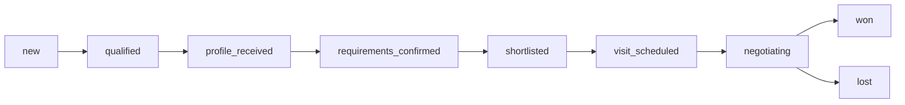

### 3.2 Flow A — ค้นหา → Inquiry

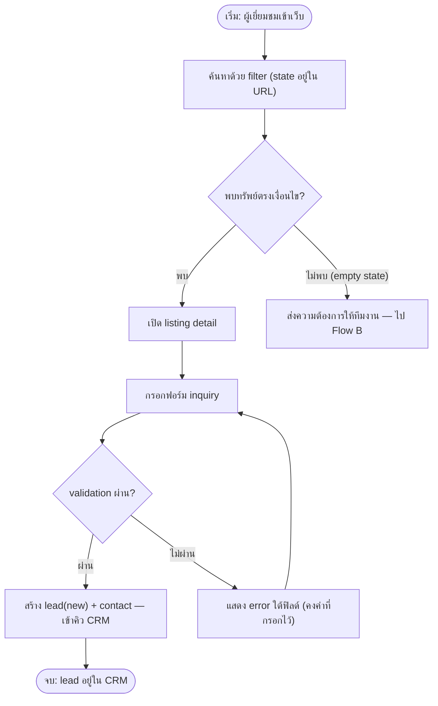

### 3.3 Flow B — Requirement → Shortlist *(ปรับปรุงตาม feedback ลูกค้า 14 ก.ค. 2026)*

จุดเปลี่ยน: **เช็ค availability ก่อนสร้าง shortlist** และ Cancel ต้องระบุข้อ requirement

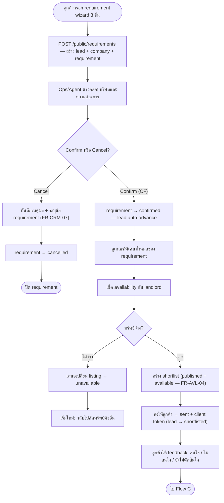

### 3.4 Flow C — Shortlist → Visit *(ปรับปรุงตาม feedback ลูกค้า 14 ก.ค. 2026)*

จุดเปลี่ยน: เริ่มด้วยยืนยัน criteria กับลูกค้า (availability check ย้ายไป Flow B แล้ว)

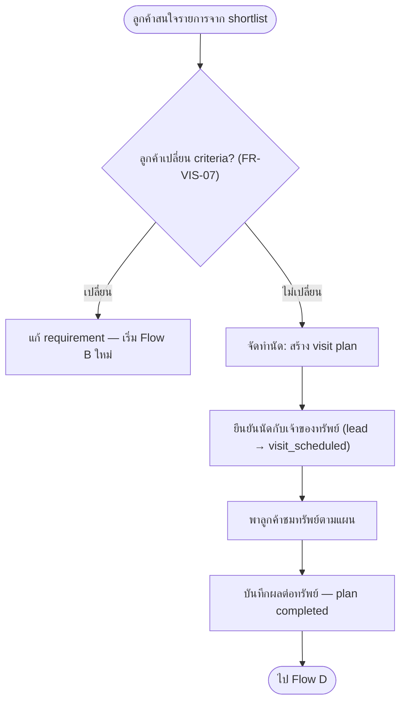

### 3.5 Flow D — Negotiation → Deal

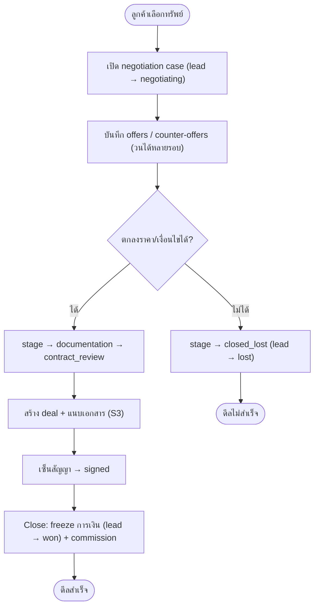

### 3.6 Flow E — Content Publishing (CMS/GEO)

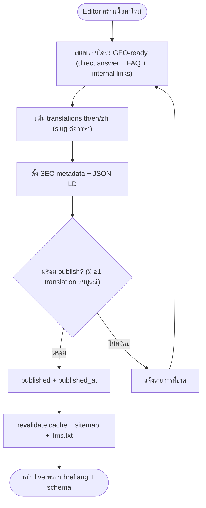

### 3.7 Listing Publish Flow (Admin)

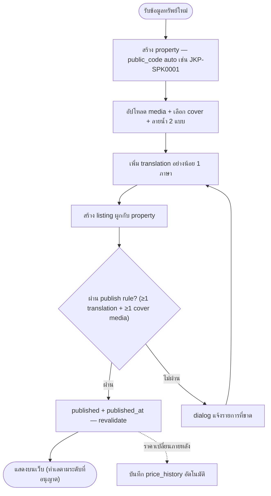

---

## Part 4 · UML Class Diagram

Domain model ระดับ conceptual (5 bounded domains) — รายละเอียด field/constraint ครบดูที่ [ERD.dbml](ERD.dbml)

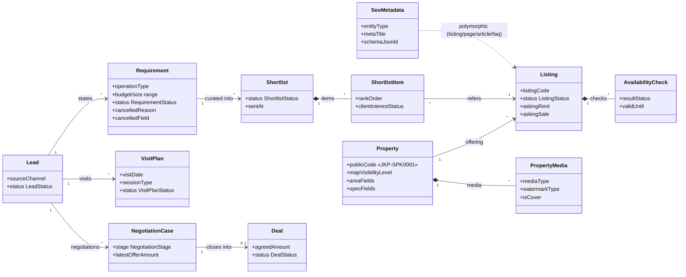

**Enumerations** (locked — [STATUS_ENUMS.md](STATUS_ENUMS.md)): `LeadStatus`(9) · `ListingStatus`(6) · `RequirementStatus`(4) · `ShortlistStatus`(5) · `VisitPlanStatus`(5) · `NegotiationStage`(7) · `DealStatus`(5) · `OperationType`(4)

---

## Part 5 · Sequence Diagrams

### 5.1 ค้นหา → ส่ง Inquiry (Flow A)

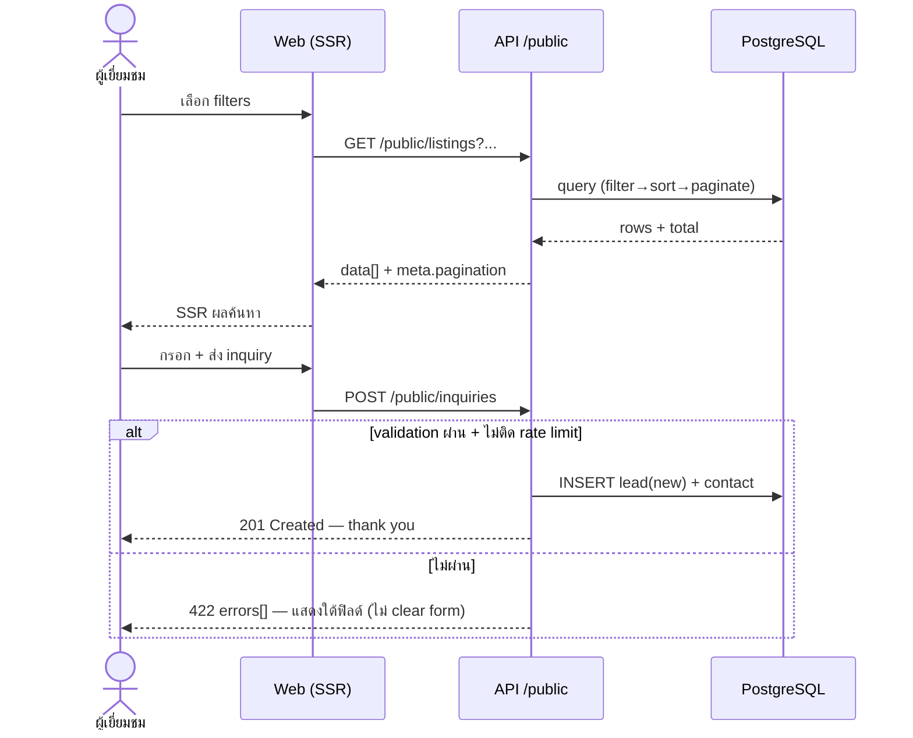

### 5.2 Requirement → Shortlist (Flow B ใหม่)

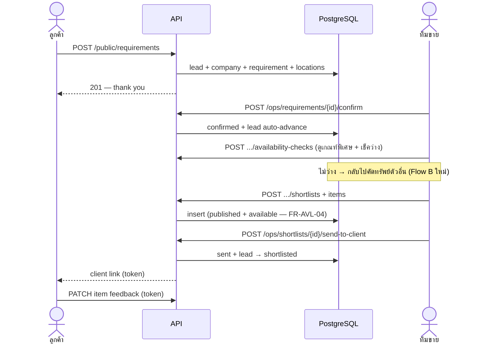

### 5.3 Criteria Gate → Visit (Flow C ใหม่)

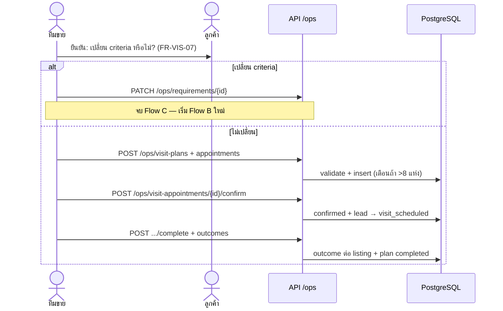

### 5.4 Negotiation → Close Deal (Flow D)

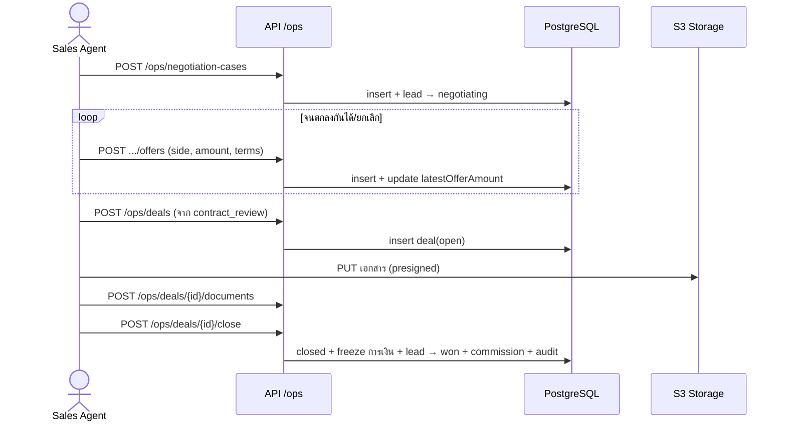

### 5.5 Listing Publish + GEO Revalidate

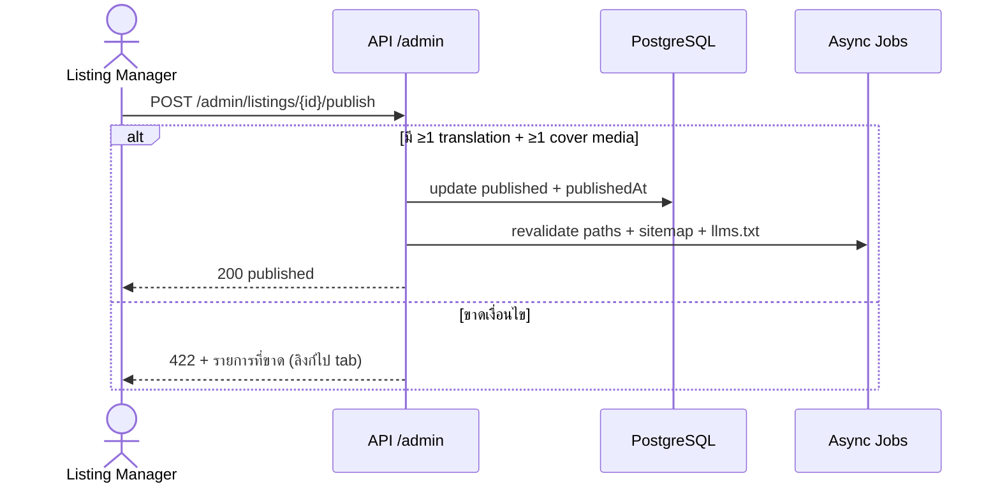

### 5.6 Public Render สำหรับ Google / AI Search

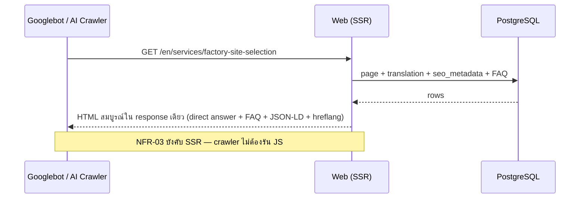

---

## Part 6 · ER Diagram (schema v1)

Schema ครบ 54 ตาราง / 91 foreign keys ในรูปแบบ DBML — เปิดใน [dbdiagram.io](https://dbdiagram.io) เพื่อดูภาพได้, และเป็น source of truth ที่ Prisma schema ต้อง sync 100%

```dbml
// =============================================================
// Industrial Property Platform — ERD v1 (DBML)
// Reconstructed from Perplexity handoff conversation (ERD schema v1)
// Source of truth for relational modeling — keep Prisma schema in sync.
//
// 5 bounded domains:
//   1. Core identity        (users, roles, agents)
//   2. Geography & taxonomy (provinces..., zones, types, landlords)
//   3. Property & Listing   (properties, listings, media, features)
//   4. CRM / Ops pipeline   (leads -> requirements -> shortlists
//                            -> visits -> negotiations -> deals)
//   5. CMS / Localization / GEO (pages, articles, FAQs, SEO metadata)
//
// Deferred / superseded (named in early draft, not defined in final ERD v1):
//   currencies, schema_blocks, internal_links, requirement_industries -> v1.1 candidates
//   locations        -> superseded by provinces/districts/subdistricts
//   lead_assignments -> superseded by leads.assigned_agent_id
// =============================================================

Project industrial_property_platform {
  database_type: 'PostgreSQL'
  Note: 'Brokerage workflow platform: listings + CRM + visit/deal ops + multilingual CMS/GEO'
}

// ---------------------------------------------------------------
// Enums (locked — do not invent statuses outside these)
// ---------------------------------------------------------------

Enum lead_status {
  new
  qualified
  profile_received
  requirements_confirmed
  shortlisted
  visit_scheduled
  negotiating
  won
  lost
}

Enum listing_status {
  draft
  review
  published
  hidden
  unavailable
  archived
}

Enum requirement_status {
  draft
  submitted
  confirmed
  cancelled
}

Enum shortlist_status {
  draft
  internal_review
  sent
  client_reviewed
  closed
}

Enum visit_plan_status {
  planning
  confirming
  confirmed
  completed
  cancelled
}

Enum negotiation_stage {
  open
  offer_submitted
  counter_offer
  documentation
  contract_review
  closed_won
  closed_lost
}

Enum deal_status {
  open
  document_pending
  signed
  closed
  cancelled
}

Enum operation_type {
  manufacturing
  assembly
  storage
  logistics
}

// ---------------------------------------------------------------
// 1) Core identity
// ---------------------------------------------------------------

Table users {
  id int [pk, increment]
  full_name varchar [not null]
  email varchar [unique, not null]
  phone varchar
  password_hash varchar [not null]
  status varchar [not null, default: 'active']
  created_at timestamp [not null, default: `now()`]
  updated_at timestamp [not null, default: `now()`]
}

Table roles {
  id int [pk, increment]
  name varchar [unique, not null, note: 'super_admin | listing_manager | sales_agent | operations_coordinator | content_editor | translator']
}

Table user_roles {
  user_id int [not null]
  role_id int [not null]

  indexes {
    (user_id, role_id) [pk]
  }
}
Ref: user_roles.user_id > users.id
Ref: user_roles.role_id > roles.id

Table agents {
  id int [pk, increment]
  user_id int [not null]
  code varchar [unique]
  language_notes varchar
  active_flag boolean [not null, default: true]
}
Ref: agents.user_id > users.id

// ---------------------------------------------------------------
// 2) Geography
// ---------------------------------------------------------------

Table provinces {
  id int [pk, increment]
  code varchar [unique, note: 'ตัวย่อภาษาอังกฤษ 3 ตัว เช่น SPK — ใช้ประกอบ public_code']
  name_en varchar [not null]
  name_th varchar [not null]
  name_zh varchar
}

Table districts {
  id int [pk, increment]
  province_id int [not null]
  name_en varchar [not null]
  name_th varchar [not null]
  name_zh varchar
}
Ref: districts.province_id > provinces.id

Table subdistricts {
  id int [pk, increment]
  district_id int [not null]
  name_en varchar [not null]
  name_th varchar [not null]
  name_zh varchar
}
Ref: subdistricts.district_id > districts.id

Table industrial_zones {
  id int [pk, increment]
  province_id int [not null]
  district_id int
  subdistrict_id int
  code varchar [unique]
  zone_type varchar [note: 'industrial_estate | free_zone | IEAT | general_zone | purple_zone']
  name_default varchar [not null]
  active_flag boolean [not null, default: true]
}
Ref: industrial_zones.province_id > provinces.id
Ref: industrial_zones.district_id > districts.id
Ref: industrial_zones.subdistrict_id > subdistricts.id

Table industrial_zone_translations {
  id int [pk, increment]
  industrial_zone_id int [not null]
  language_code varchar [not null]
  name varchar [not null]
  description text
}
Ref: industrial_zone_translations.industrial_zone_id > industrial_zones.id
Ref: industrial_zone_translations.language_code > languages.code

// ---------------------------------------------------------------
// Taxonomy & parties
// ---------------------------------------------------------------

Table property_types {
  id int [pk, increment]
  code varchar [unique, not null, note: 'warehouse | factory | land | mixed']
  name_default varchar [not null]
}

Table transaction_types {
  id int [pk, increment]
  code varchar [unique, not null, note: 'rent | sale | both']
  name_default varchar [not null]
}

Table landlords {
  id int [pk, increment]
  company_name varchar
  contact_name varchar
  email varchar
  phone varchar
  preferred_language varchar
  notes text
  active_flag boolean [not null, default: true]
}

Table developers {
  id int [pk, increment]
  company_name varchar [not null]
  contact_name varchar
  email varchar
  phone varchar
  notes text
  active_flag boolean [not null, default: true]
}

// ---------------------------------------------------------------
// 3) Property domain
// ---------------------------------------------------------------

Table properties {
  id int [pk, increment]
  public_code varchar [unique, not null, note: 'auto-generate: กทม JKP{n} / ตจว JKP-{province.code}{n}, n = เลขรัน 4 หลัก zero-pad เริ่ม 0001 นับแยกต่อ prefix — read-only']
  property_type_id int [not null]
  landlord_id int
  developer_id int
  province_id int [not null]
  district_id int [not null]
  subdistrict_id int [not null]
  address_private varchar [note: 'never exposed publicly']
  latitude decimal
  longitude decimal
  map_visibility_level varchar [note: 'exact | subdistrict | district | province']
  land_area_sqm decimal
  built_up_area_sqm decimal
  warehouse_area_sqm decimal
  office_area_sqm decimal
  clear_height_m decimal
  floor_loading_ton_per_sqm decimal
  power_capacity_kva decimal
  factory_license_possible boolean
  zoning_notes text
  tax_notes text
  status varchar [not null]
  source_type varchar
  source_reference varchar
  created_by int [not null]
  created_at timestamp [not null, default: `now()`]
  updated_at timestamp [not null, default: `now()`]
}
Ref: properties.property_type_id > property_types.id
Ref: properties.landlord_id > landlords.id
Ref: properties.developer_id > developers.id
Ref: properties.province_id > provinces.id
Ref: properties.district_id > districts.id
Ref: properties.subdistrict_id > subdistricts.id
Ref: properties.created_by > users.id

Table property_translations {
  id int [pk, increment]
  property_id int [not null]
  language_code varchar [not null]
  title varchar [not null]
  short_description text
  long_description text
  location_summary text
  key_selling_points text

  indexes {
    (property_id, language_code) [unique]
  }
}
Ref: property_translations.property_id > properties.id
Ref: property_translations.language_code > languages.code

Table property_industrial_zones {
  property_id int [not null]
  industrial_zone_id int [not null]

  indexes {
    (property_id, industrial_zone_id) [pk]
  }
}
Ref: property_industrial_zones.property_id > properties.id
Ref: property_industrial_zones.industrial_zone_id > industrial_zones.id

Table property_media {
  id int [pk, increment]
  property_id int [not null]
  media_type varchar [not null, note: 'image | video | floorplan | document']
  watermark_type varchar [note: 'style_1 | style_2 — เลือกตอนอัปโหลด apply ก่อนแสดง public']
  file_url varchar [not null]
  alt_text varchar
  sort_order int [not null, default: 0]
  is_cover boolean [not null, default: false]
  created_at timestamp [not null, default: `now()`]
}
Ref: property_media.property_id > properties.id

// ---------------------------------------------------------------
// 4) Listings
// ---------------------------------------------------------------

Table listings {
  id int [pk, increment]
  property_id int [not null]
  transaction_type_id int [not null]
  listing_code varchar [unique, not null]
  status listing_status [not null, default: 'draft']
  asking_rent_amount decimal
  asking_sale_amount decimal
  currency_code varchar [not null, default: 'THB']
  minimum_divisible_area_sqm decimal
  available_from date
  available_to date
  exclusive_flag boolean [not null, default: false]
  featured_flag boolean [not null, default: false]
  published_at timestamp
  unpublished_at timestamp
  created_by int [not null]
  updated_by int
  created_at timestamp [not null, default: `now()`]
  updated_at timestamp [not null, default: `now()`]
}
Ref: listings.property_id > properties.id
Ref: listings.transaction_type_id > transaction_types.id
Ref: listings.created_by > users.id
Ref: listings.updated_by > users.id

Table listing_translations {
  id int [pk, increment]
  listing_id int [not null]
  language_code varchar [not null]
  title_override varchar
  teaser_text text
  callout_text text

  indexes {
    (listing_id, language_code) [unique]
  }
}
Ref: listing_translations.listing_id > listings.id
Ref: listing_translations.language_code > languages.code

Table price_history {
  id int [pk, increment]
  listing_id int [not null]
  price_type varchar [not null, note: 'rent | sale']
  old_amount decimal
  new_amount decimal [not null]
  currency_code varchar [not null]
  changed_at timestamp [not null, default: `now()`]
  changed_by int [not null]
}
Ref: price_history.listing_id > listings.id
Ref: price_history.changed_by > users.id

Table availability_checks {
  id int [pk, increment]
  listing_id int [not null]
  checked_at timestamp [not null, default: `now()`]
  checked_by int [not null]
  result_status varchar [not null, note: 'available | unavailable | pending_landlord']
  landlord_response_notes text
  valid_until date
}
Ref: availability_checks.listing_id > listings.id
Ref: availability_checks.checked_by > users.id

// ---------------------------------------------------------------
// 5) Features & tags
// ---------------------------------------------------------------

Table property_features {
  id int [pk, increment]
  code varchar [unique, not null]
  group_name varchar
  data_type varchar [not null, note: 'text | number | boolean']
  unit varchar
  active_flag boolean [not null, default: true]
}

Table property_feature_values {
  id int [pk, increment]
  property_id int [not null]
  feature_id int [not null]
  value_text varchar
  value_number decimal
  value_boolean boolean

  indexes {
    (property_id, feature_id) [unique]
  }
}
Ref: property_feature_values.property_id > properties.id
Ref: property_feature_values.feature_id > property_features.id

Table tags {
  id int [pk, increment]
  code varchar [unique, not null]
  name_default varchar [not null]
}

Table property_tags {
  property_id int [not null]
  tag_id int [not null]

  indexes {
    (property_id, tag_id) [pk]
  }
}
Ref: property_tags.property_id > properties.id
Ref: property_tags.tag_id > tags.id

// ---------------------------------------------------------------
// 6) Lead / CRM
// ---------------------------------------------------------------

Table companies {
  id int [pk, increment]
  company_name varchar [not null]
  registration_country varchar
  website_url varchar
  business_activity varchar
  product_type varchar
  worker_count int
  machine_hp decimal
  pollution_profile varchar [note: 'noise | smell | dust | wastewater | none']
  notes text
  created_at timestamp [not null, default: `now()`]
}

Table leads {
  id int [pk, increment]
  source_channel varchar [not null, note: 'website_form | line | wechat | whatsapp | phone | referral']
  source_detail varchar
  preferred_language varchar
  status lead_status [not null, default: 'new']
  assigned_agent_id int
  company_id int
  created_at timestamp [not null, default: `now()`]
  updated_at timestamp [not null, default: `now()`]
}
Ref: leads.assigned_agent_id > agents.id
Ref: leads.company_id > companies.id

Table lead_contacts {
  id int [pk, increment]
  lead_id int [not null]
  full_name varchar [not null]
  email varchar
  phone varchar
  position_title varchar
  is_primary boolean [not null, default: false]
}
Ref: lead_contacts.lead_id > leads.id

Table requirements {
  id int [pk, increment]
  lead_id int [not null]
  operation_type operation_type
  need_factory_license boolean
  budget_rent_min decimal
  budget_rent_max decimal
  budget_sale_min decimal
  budget_sale_max decimal
  size_min_sqm decimal
  size_max_sqm decimal
  move_in_date date
  near_port boolean
  near_airport boolean
  near_bangkok boolean
  notes text
  status requirement_status [not null, default: 'submitted']
  cancelled_reason varchar [note: 'บังคับเมื่อ cancel']
  cancelled_field varchar [note: 'ข้อ requirement ที่เป็นเหตุ: budget | size | location | license | timeline | other']
  created_at timestamp [not null, default: `now()`]
  updated_at timestamp [not null, default: `now()`]
}
Ref: requirements.lead_id > leads.id

Table requirement_locations {
  id int [pk, increment]
  requirement_id int [not null]
  province_id int
  district_id int
  subdistrict_id int
  industrial_zone_id int
  priority_rank int [not null, default: 1]
}
Ref: requirement_locations.requirement_id > requirements.id
Ref: requirement_locations.province_id > provinces.id
Ref: requirement_locations.district_id > districts.id
Ref: requirement_locations.subdistrict_id > subdistricts.id
Ref: requirement_locations.industrial_zone_id > industrial_zones.id

Table shortlists {
  id int [pk, increment]
  requirement_id int [not null]
  prepared_by int [not null]
  status shortlist_status [not null, default: 'draft']
  sent_at timestamp
  client_feedback_notes text
  created_at timestamp [not null, default: `now()`]
}
Ref: shortlists.requirement_id > requirements.id
Ref: shortlists.prepared_by > users.id

Table shortlist_items {
  id int [pk, increment]
  shortlist_id int [not null]
  listing_id int [not null]
  rank_order int [not null, default: 1]
  internal_notes text
  client_interest_status varchar [note: 'interested | not_interested | undecided']

  indexes {
    (shortlist_id, listing_id) [unique]
  }
}
Ref: shortlist_items.shortlist_id > shortlists.id
Ref: shortlist_items.listing_id > listings.id

Table lead_notes {
  id int [pk, increment]
  lead_id int [not null]
  user_id int [not null]
  note_type varchar
  note_body text [not null]
  created_at timestamp [not null, default: `now()`]
}
Ref: lead_notes.lead_id > leads.id
Ref: lead_notes.user_id > users.id

Table activities {
  id int [pk, increment]
  lead_id int
  requirement_id int
  shortlist_id int
  actor_user_id int [not null]
  activity_type varchar [not null]
  payload_json jsonb
  created_at timestamp [not null, default: `now()`]
}
Ref: activities.lead_id > leads.id
Ref: activities.requirement_id > requirements.id
Ref: activities.shortlist_id > shortlists.id
Ref: activities.actor_user_id > users.id

Table tasks {
  id int [pk, increment]
  lead_id int
  assigned_to int [not null]
  title varchar [not null]
  due_at timestamp
  status varchar [not null, default: 'open']
  priority varchar [not null, default: 'normal']
  created_at timestamp [not null, default: `now()`]
}
Ref: tasks.lead_id > leads.id
Ref: tasks.assigned_to > users.id

// ---------------------------------------------------------------
// 7) Visits / deal ops
// ---------------------------------------------------------------

Table visit_plans {
  id int [pk, increment]
  lead_id int [not null]
  requirement_id int [not null]
  planned_by int [not null]
  visit_date date [not null]
  session_type varchar [not null, note: 'half_day | full_day (5-8 locations per session)']
  status visit_plan_status [not null, default: 'planning']
  route_notes text
  created_at timestamp [not null, default: `now()`]
}
Ref: visit_plans.lead_id > leads.id
Ref: visit_plans.requirement_id > requirements.id
Ref: visit_plans.planned_by > users.id

Table visit_appointments {
  id int [pk, increment]
  visit_plan_id int [not null]
  landlord_id int
  scheduled_start timestamp [not null]
  scheduled_end timestamp [not null]
  status varchar [not null, default: 'pending']
  confirmation_notes text
  created_at timestamp [not null, default: `now()`]
}
Ref: visit_appointments.visit_plan_id > visit_plans.id
Ref: visit_appointments.landlord_id > landlords.id

Table visit_properties {
  id int [pk, increment]
  visit_appointment_id int [not null]
  listing_id int [not null]
  sequence_no int [not null, default: 1]
  feedback_notes text
  outcome_status varchar
}
Ref: visit_properties.visit_appointment_id > visit_appointments.id
Ref: visit_properties.listing_id > listings.id

Table negotiation_cases {
  id int [pk, increment]
  lead_id int [not null]
  listing_id int [not null]
  owner_side_party_id int
  assigned_agent_id int [not null]
  stage negotiation_stage [not null, default: 'open']
  target_amount decimal
  latest_offer_amount decimal
  notes text
  opened_at timestamp [not null, default: `now()`]
  updated_at timestamp [not null, default: `now()`]
}
Ref: negotiation_cases.lead_id > leads.id
Ref: negotiation_cases.listing_id > listings.id
Ref: negotiation_cases.owner_side_party_id > landlords.id
Ref: negotiation_cases.assigned_agent_id > agents.id

Table offers {
  id int [pk, increment]
  negotiation_case_id int [not null]
  offer_side varchar [not null, note: 'client | landlord']
  amount decimal [not null]
  currency_code varchar [not null, default: 'THB']
  terms_notes text
  status varchar [not null, default: 'submitted']
  submitted_at timestamp [not null, default: `now()`]
}
Ref: offers.negotiation_case_id > negotiation_cases.id

Table deals {
  id int [pk, increment]
  lead_id int [not null]
  listing_id int [not null]
  negotiation_case_id int
  transaction_type_id int [not null]
  agreed_amount decimal [not null]
  currency_code varchar [not null, default: 'THB']
  signed_date date
  close_date date
  status deal_status [not null, default: 'open']
  notes text
}
Ref: deals.lead_id > leads.id
Ref: deals.listing_id > listings.id
Ref: deals.negotiation_case_id > negotiation_cases.id
Ref: deals.transaction_type_id > transaction_types.id

Table deal_documents {
  id int [pk, increment]
  deal_id int [not null]
  document_type varchar [not null]
  file_url varchar [not null]
  status varchar [not null, default: 'pending']
  uploaded_by int [not null]
  uploaded_at timestamp [not null, default: `now()`]
}
Ref: deal_documents.deal_id > deals.id
Ref: deal_documents.uploaded_by > users.id

Table commissions {
  id int [pk, increment]
  deal_id int [not null]
  agent_id int [not null]
  commission_amount decimal [not null]
  currency_code varchar [not null, default: 'THB']
  payout_status varchar [not null, default: 'pending']
}
Ref: commissions.deal_id > deals.id
Ref: commissions.agent_id > agents.id

// ---------------------------------------------------------------
// 8) CMS / localization / GEO
// ---------------------------------------------------------------

Table languages {
  code varchar [pk, note: 'th | en | zh']
  name varchar [not null]
  is_default boolean [not null, default: false]
}

Table pages {
  id int [pk, increment]
  page_type varchar [not null, note: 'service | area | landing | static']
  slug_default varchar [not null]
  status varchar [not null, default: 'draft']
  parent_page_id int
  created_by int [not null]
  updated_by int
  created_at timestamp [not null, default: `now()`]
  updated_at timestamp [not null, default: `now()`]
}
Ref: pages.parent_page_id > pages.id
Ref: pages.created_by > users.id
Ref: pages.updated_by > users.id

Table page_translations {
  id int [pk, increment]
  page_id int [not null]
  language_code varchar [not null]
  slug varchar [not null]
  title varchar [not null]
  excerpt text
  body_richtext text

  indexes {
    (page_id, language_code) [unique]
    (language_code, slug) [unique]
  }
}
Ref: page_translations.page_id > pages.id
Ref: page_translations.language_code > languages.code

Table articles {
  id int [pk, increment]
  category_code varchar [note: 'permit | tax | eec | renting-vs-buying | ...']
  hero_image_url varchar
  author_user_id int [not null]
  status varchar [not null, default: 'draft']
  published_at timestamp
  created_at timestamp [not null, default: `now()`]
  updated_at timestamp [not null, default: `now()`]
}
Ref: articles.author_user_id > users.id

Table article_translations {
  id int [pk, increment]
  article_id int [not null]
  language_code varchar [not null]
  slug varchar [not null]
  title varchar [not null]
  summary text
  body_richtext text

  indexes {
    (article_id, language_code) [unique]
    (language_code, slug) [unique]
  }
}
Ref: article_translations.article_id > articles.id
Ref: article_translations.language_code > languages.code

Table faq_items {
  id int [pk, increment]
  category_code varchar
  sort_order int [not null, default: 0]
  active_flag boolean [not null, default: true]
}

Table faq_translations {
  id int [pk, increment]
  faq_item_id int [not null]
  language_code varchar [not null]
  question varchar [not null]
  answer_richtext text [not null]

  indexes {
    (faq_item_id, language_code) [unique]
  }
}
Ref: faq_translations.faq_item_id > faq_items.id
Ref: faq_translations.language_code > languages.code

Table certifications {
  id int [pk, increment]
  code varchar [unique, not null]
  image_url varchar
  external_url varchar
  active_flag boolean [not null, default: true]
}

Table certification_translations {
  id int [pk, increment]
  certification_id int [not null]
  language_code varchar [not null]
  title varchar [not null]
  description text

  indexes {
    (certification_id, language_code) [unique]
  }
}
Ref: certification_translations.certification_id > certifications.id
Ref: certification_translations.language_code > languages.code

Table seo_metadata {
  id int [pk, increment]
  entity_type varchar [not null, note: 'listing | property | page | article | faq']
  entity_id int [not null]
  language_code varchar [not null]
  meta_title varchar
  meta_description varchar
  canonical_url varchar
  robots_index boolean [not null, default: true]
  robots_follow boolean [not null, default: true]
  og_title varchar
  og_description varchar
  schema_jsonld jsonb

  indexes {
    (entity_type, entity_id, language_code) [unique]
  }
}
Ref: seo_metadata.language_code > languages.code

Table audit_logs {
  id int [pk, increment]
  user_id int [not null]
  entity_type varchar [not null]
  entity_id int [not null]
  action varchar [not null]
  before_json jsonb
  after_json jsonb
  created_at timestamp [not null, default: `now()`]
}
Ref: audit_logs.user_id > users.id
```

---

*Specification Pack v1.1 · Industrial Property Platform · 14 กรกฎาคม 2026 · สถานะ Draft*
*ไฟล์ HTML/PDF ที่มีไดอะแกรมเป็นภาพ vector: `SPEC_PACK.html`, `SPEC_PACK.pdf`*
